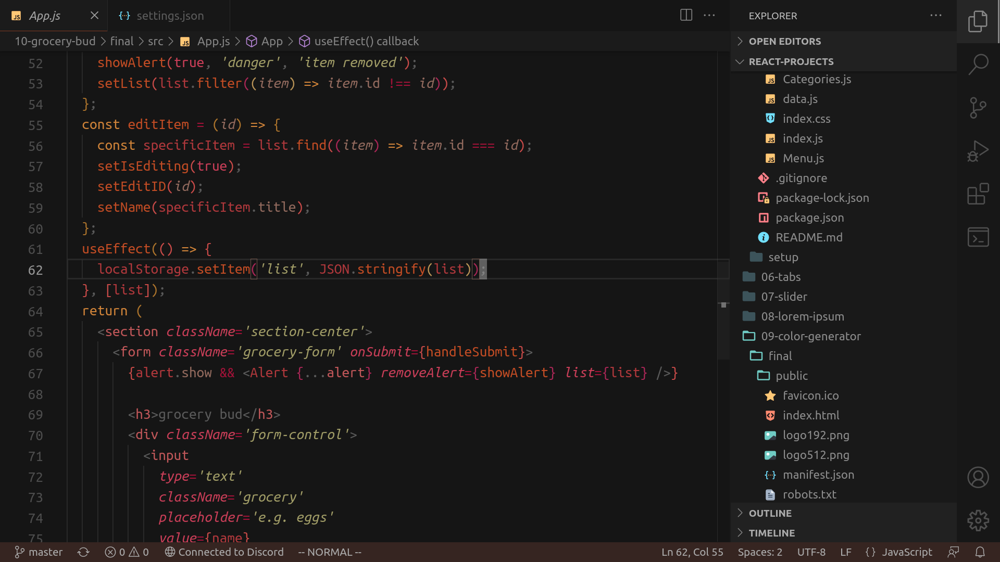

# Yours Sincerely
A theme with pretty pigments and a particular attention to detail.

My motivation for this project was a struggle to find a warm, low-contrast theme that I liked. This is what i had in mind when searching. It comprises elements of Monokai, Tinacious, and the classic VS Dark.

## Themes

### Sunkissed

Low-contrast colours with minimal eye strain.

### Moonbeam

The polar twin of Sunkissed, focusing on the colder spectrum.

## Notes
- A possible future update incorporates a broader range of colour schemes (e.g. purple).
- Feedback is appreciated particularly on palette choice and semantic highlighting.

Code screenshots from https://github.com/john-smilga/react-projects.