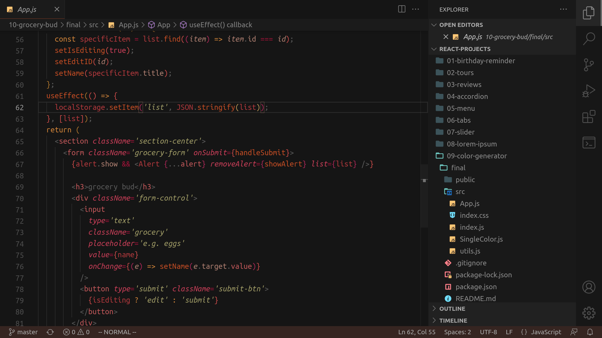
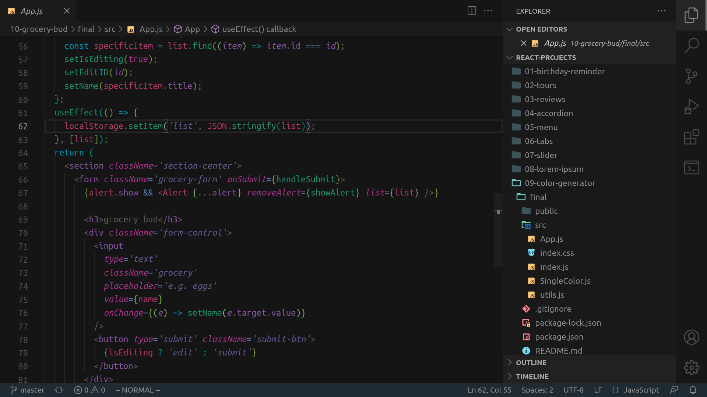

# Yours Sincerely
A theme with pretty pigments and a particular attention to detail.

I decided on this project after a struggle to find a warm, low-contrast theme to my liking. This is what I had in mind when searching. It comprises elements of Monokai, Tinacious, and the classic VS Dark.

[View it on the Visual Studio Marketplace](https://marketplace.visualstudio.com/items?itemName=LilyO.yours-sincerely-theme).

## Themes

### Sunkissed

Low-contrast colours with minimal eye strain.



### Moonbeam

The polar twin of Sunkissed, focusing on the colder spectrum.



## Installation

Download the [theme VSIX file](https://github.com/LilyAsFlora/Yours-Sincerely/blob/master/yours-sincerely-theme-0.0.2.vsix) and follow the [VSIX installation guide](https://code.visualstudio.com/docs/editor/extension-marketplace#_install-from-a-vsix).

Alternatively, you can download Yours Sincerely from the [Visual Studio Marketplace](https://marketplace.visualstudio.com/items?itemName=LilyO.yours-sincerely-theme).

Furthermore, you can install the theme directly from Visual Studio Code by opening the opening the [command palette](https://code.visualstudio.com/docs/getstarted/userinterface#_command-palette) and executing the following:
```
ext install LilyO.yours-sincerely-theme
```

...or by searching 'Yours Sincerely Theme' in the Extensions tab.

## Notes
- A possible future update incorporates a broader range of colour schemes (e.g. purple).
- Feedback is appreciated particularly on palette choice and semantic highlighting.

Code screenshots from https://github.com/john-smilga/react-projects.
